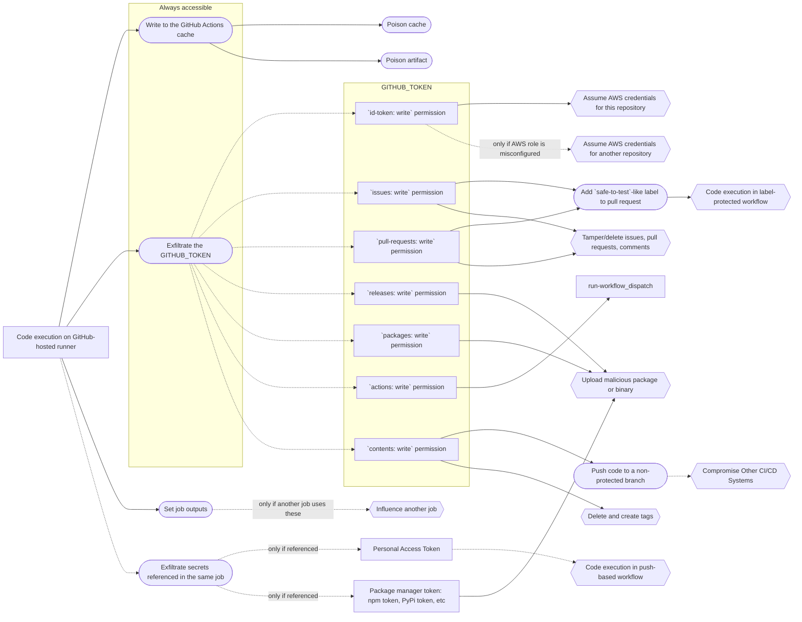

# Assesing impact of GitHub Actions workflow vulnerability

When GitHub Actions were first introduced a vulnerability in a workflow meant that the affected repository was completely compromised: its contents could be modified; all the secrets exfiltrated, including organization-wide secrets (!); and all other parts of the repository like issues, projects, etc cloud be modified or deleted.

Today is different. There are much more mitigation mechanisms available and the maintainers are more aware of them as well as the vulnerabilities in workflows. So code execution on a runner does not necessarily means critical or even high impact anymore.

This writing will support you in assessing the impact of a particular workflow vulnerability. This is by no means a complete enumeration of all the possible impacts but rather a list of the common ones.

## General context

First of all, the impact depends on the repository itself: how popular it is, whether it is runnable code or documentation, what secrets it has access to, etc.

Second, code execution happens on a workflow job which is isolated from other jobs and workflows by default. Usually, one needs to escape it by cache or artifact poisoning, exfiltrating the GITHUB_TOKEN or other secrets, or by some other means.

On the diagram below you may see possible paths starting from code execution on a GitHub-hosted runner and ending with a particular impact.

In the following sections the paths will be unpacked.

## The `GITHUB_TOKEN`

The `GITHUB_TOKEN` secret is always passed to a workflow run. See [Universal payload for the `GITHUB_TOKEN` exfiltration](https://gist.github.com/nikitastupin/30e525b776c409e03c2d6f328f254965) for more information. By default, the `GITHUB_TOKEN` has read-only permissions for repositories created after 2023-02-02. However, since most of repositories were created before 2023-02-02 it still has write permissions in many cases.

(Un)fortunately, the `GITHUB_TOKEN` cannot trigger workflows with the exception of `workflow_dispatch` and `repository_dispatch` which limits the impact. See [Triggering a workflow from a workflow](https://docs.github.com/en/actions/using-workflows/triggering-a-workflow#triggering-a-workflow-from-a-workflow) for more information. Interestingly, it is not meant to be a security mitigation but functions like one.

The most impactful permissions are `contents`, `id-token`, `releases`, and `packages`. Some of the less impactful permissions include `issues` and `pull-requests`. Let us take a closer look at each of them.

### `contents: wirte`

The `contents: wirte` permission is among the most dangerous and in general allows to:

1. Push to the repository.
1. Delete and create tags.
1. Delete and create releases.

Many projects apply branch-protection rules to the default branch so usually it is not possible to push to the default branch. Still, it is possible to modify the contents of a non-protected branch and [create, edit, or delete releases](https://docs.github.com/en/rest/overview/permissions-required-for-github-apps?apiVersion=2022-11-28#repository-permissions-for-contents).

Furthermore, it is not possible to modify the contents of the `.github/workflows` directory.

However, other workflow files like `.circleci/config.yml` can be modified. Since CircleCI workflows are are triggered [each time a commit is pushed on a branch that has a `.circleci/config.yml` file included](https://circleci.com/docs/triggers-overview/#run-a-pipeline-on-commit-to-your-code-repository) it is possible to push a malicious `.circleci/config.yml` to a non-protected branch. Consequtively, this will trigger a CircleCI workflow with the malicious code that exfiltrates all secrets from the CircleCI environment.

If there is a `pull_request_target` workflow that does not checkout from a fork but does checkout and execute code it is possible to push malicious code to a non-protected branch and open a pull request to that branch. Since the pull request is opened with an external account it will trigger the `pull_request_target` workflow and because the target branch contains malicious code the workflow will be compromised.

### `id-token: write`

If the `id-token: write` permission is set then it may be possible to issue cloud tokens (e.g. AWS or GCP credentials). The impact then depends on what permissions the cloud tokens have.

### `actions: write`

This permission allows to run `workflow_dispatch` workflows which usually are less restricted and have access to more secrets.

### `issues: write` or `pull-requests: write`

At first glance it seems that these permissions are relatively harmless. However, given that many workflows are label-protected, these permissions allow to bypass this protection.

Another way, which I have not tested yet, is to use the permissions to modify issue body or title and run a `pull_request` workflow where these will lead to an injection vulnerability.

## Further research

- It might be possible to escalate from the `GITHUB_TOKEN` with `contents: write` permissions to all the repository secrets and organization-wide secrets. If other CI/CD systems are used with a GitHub repository and have push access to the repository it should be possible to (1) use the exfiltrated `GITHUB_TOKEN` to push to a non-protected branch (2) triggering another CI/CD system and (3) push back to the repository's `.github/workflows` directory with a `pull_request_target` workflow that exfiltrates all the repository secrets and organization-wide secrets. [How to push a commit back to the same repository as part of the CircleCI job](https://support.circleci.com/hc/en-us/articles/360018860473-How-to-push-a-commit-back-to-the-same-repository-as-part-of-the-CircleCI-job) - need see when and how this works.

## References

- [GitHub Actions – Updating the default GITHUB_TOKEN permissions to read-only](https://github.blog/changelog/2023-02-02-github-actions-updating-the-default-github_token-permissions-to-read-only/)
- [Assigning permissions to jobs](https://docs.github.com/en/actions/using-jobs/assigning-permissions-to-jobs)
- [Permissions required for GitHub Apps](https://docs.github.com/en/rest/overview/permissions-required-for-github-apps?apiVersion=2022-11-28)
- [Diagram Syntax | Mermaid](https://mermaid.js.org/intro/n00b-syntaxReference.html)
