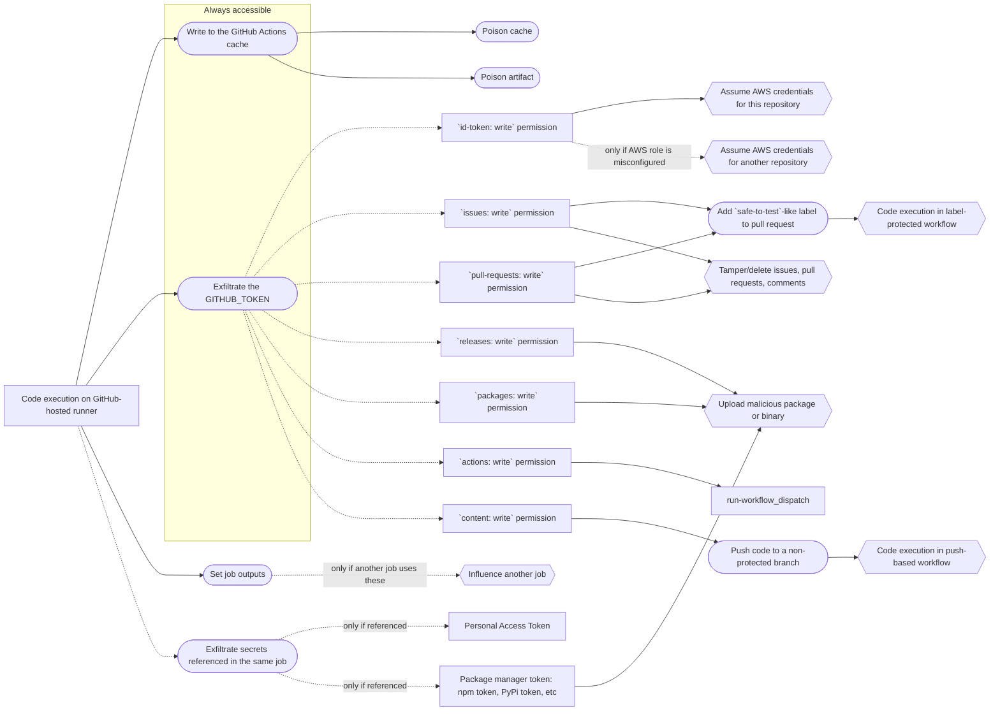

# Assesing impact of GitHub Actions workflow vulnerability

When GitHub Actions were first introduced a vulnerability in a workflow meant that the affected repository was completely compromised: its contents could be modified; all the secrets exfiltrated, including organization-wide secrets (!); and all other parts of the repository like issues, projects, etc cloud be modified or deleted.

Today is different. There are much more mitigation mechanisms available and the maintainers are more aware of them as well as the vulnerabilities in workflows. So code execution on a runner does not necessarily means critical or even high impact anymore.

This writing will support you in assessing the impact of a particular workflow vulnerability. This is by no means a complete enumeration of all the possible impacts but rather a list of the common ones.

## General context

First of all, the impact depends on the repository itself: how popular it is, whether it is runnable code or documentation, what secrets it has access to, etc.

Second, code execution happens on a workflow job which is isolated from other jobs and workflows by default. Usually, one needs to escape it by cache or artifact poisoning, exfiltrating the GITHUB_TOKEN or other secrets, or by some other means.

On the diagram below you may see possible paths starting from code execution on a GitHub-hosted runner and ending with a particular impact.

In the following sections the paths will be unpacked.

## The `GITHUB_TOKEN`

The `GITHUB_TOKEN` secret is always passed to a workflow run. See https://gist.github.com/nikitastupin/30e525b776c409e03c2d6f328f254965 for an example of a universal exfiltration technique. By default it has read-only permissions for the repositories created after 2023-02-02. However, since most of repositories were created before 2023-02-02 it still has write permissions in many cases.

The most impactful permissions are `contents`, `id-token`, `issues`, `pull-requests`, `releases`, and `packages`. Let us take a closer look at each of them.

### `contents: wirte`

It is usually not possible to use the permission to push to the default branch because of the branch-protection rules. However, there is usually a release workflow in a repository which are triggered by the `push` or `release` events. A release workflow naturally has access to package manager secrets because it needs those to publish packages.

So the `GITHUB_TOKEN` with `contents: write` permission can be used to modify the contents of a non-protected branch and [publish or edit releases](https://docs.github.com/en/rest/overview/permissions-required-for-github-apps?apiVersion=2022-11-28#contents). This leads to triggering the release workflow with `GITHUB_SHA` and `GITHUB_REF` set to the non-protected branch, check out from the non-protected branch, building that leads to code execution, and finally access to a package manager secret.

### `id-token: write`

If the `id-token: write` permission is set then it may be possible to issue cloud tokens (e.g. AWS or GCP credentials). The impact then depends on what permissions the cloud tokens have.

### `actions: write`

This permission allows to run `workflow_dispatch` workflows which usually are less restricted and have access to more secrets.

### `issues: write` or `pull-requests: write`

At first glance it seems that these permissions are relatively harmless. However, given that many workflows are label-protected, these permissions allow to bypass this protection.

Another way, which I have not tested yet, is to use the permissions to modify issue body or title and run a `pull_request` workflow where these will lead to an injection vulnerability.

## References

- [GitHub Actions – Updating the default GITHUB_TOKEN permissions to read-only](https://github.blog/changelog/2023-02-02-github-actions-updating-the-default-github_token-permissions-to-read-only/)
- [Assigning permissions to jobs](https://docs.github.com/en/actions/using-jobs/assigning-permissions-to-jobs)
- [Permissions required for GitHub Apps](https://docs.github.com/en/rest/overview/permissions-required-for-github-apps?apiVersion=2022-11-28)
- [Diagram Syntax | Mermaid](https://mermaid.js.org/intro/n00b-syntaxReference.html)
